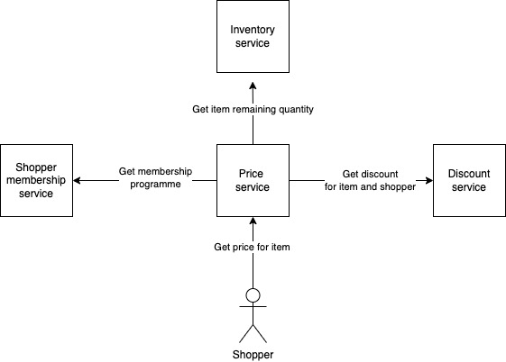

## Tests for distributed systems

When testing a functionality that spans across multiple microservices, there are some tradeoffs to make between tests maintainability and coverage.
As an example, let's take a Price microservice which needs to contact three other microservices to be able to calculate a price.
We are responsible for the Price microservice only, while other teams take care of Membership, Discount and Inventory microservices respectively.   

Let's assume we want to write an acceptance test to verify the functionality of calculating a price.
For this purpose, we need also the other three microservices to be up running while the acceptance test runs.
Usually there are four ways to achieve this. Each one has pros and cons, but in my experience, the first has proved to be superior.  
In all four alternatives, when we say locally, we mean both the developers laptops and the [continuous integration](https://martinfowler.com/articles/continuousIntegration.html) machine.

### Stub the three microservices integration locally and use in depth smoke tests
The acceptance test is converted into a functional test that runs locally and a smoke test that runs against the different environments (e.g. development and production).
Regarding the functional test, the Price service is started by stubbing the integration with the other three microservices.
This means that despite the integration with the three microservices might happen over https, when the functional test runs, there is no network or other infrastructure involved.  

Regarding the smoke test, it triggers the real integration between the four microservices, as a production shopper request would do.  

Pros:
* The smoke test verifies the real logic for both 4 microservices
* No extra infrastructure needed locally
* No powerful hardware needed locally
* Chance of writing many functional tests in exchange for the acceptance test as the former is faster to run, write and maintain than the latter
* No need to worry about authentication at functional test level

Cons:
* Integration bugs between microservices cannot be caught locally: they will be visible during the smoke test execution.  
  This late feedback loop around integration can be fixed by using contract testing (see resources section below)
* Difficult to stub the three microservices integration if infrastructure is mixed with domain inside the Price service codebase

### Integrate with the other three microservices deployed in dev environment
This implies that the acceptance test reaches out to the dev environment where Inventory, Discount and Membership microservices are deployed.   

Pros:
* The acceptance test verifies the real logic for both 4 microservices, nothing is stubbed
* No extra infrastructure needed locally
* No powerful hardware needed  

Cons
* Network connectivity is needed
* Extra network configuration (e.g. VPN, firewall rules)
* Risk of race conditions on test data related to the three microservices as multiple devs and continuous integration machine might run tests simultaneously
* Extra work possibly needed for authentication

### Run the other three microservices locally
This implies fetching the executables of the other three microservices (e.g. Docker images, jar, etc.) and running them locally while the acceptance test is executed.  

Pros:
* The acceptance test verifies the real logic for both 4 microservices, nothing is stubbed  

Cons:
* Acceptance test is slow as all fours microservices have to startup first
* More powerful hardware is needed (usually ram and cpu) locally
* Extra infrastructure is needed to make available the Inventory, Discount and Membership microservices executables (e.g. VPN, access policies configuration, firewall rules, etc.)
* Extra setup is needed locally to run the acceptance tests (e.g. install Docker)
* Extra work possibly needed for user authentication

### Stub the three microservices locally
This implies using libraries like [WireMock server](https://wiremock.org/docs/getting-started/) to stub the responses from the other three microservices.  

Pros:
* No network connectivity needed

Cons:
* Slower acceptance test as 3 microservices stubs need to startup
* External library as extra test dependency
* If any api contract change happens in the other three microservices, the acceptance test won't fail
* Requires effective and timely communication between the four microservices teams to notify and adjust any api contract change

   

#### Recommended reads
* [Testing strategies in a microservice architecture - Toby Clemson](https://martinfowler.com/articles/microservice-testing/)
* [Contract testing - Ham Vocke](https://martinfowler.com/articles/practical-test-pyramid.html#ContractTests)
* [QA in production - Rouan Wilsenach](https://martinfowler.com/articles/qa-in-production.html)
* [Synthetic Monitoring - Flávia Falé, Serge Gebhardt](https://martinfowler.com/bliki/SyntheticMonitoring.html)

#### Teach me back
I really appreciate any [feedback](../introduction/introduction.html#teach-me-back) about the book and my current understanding of software design.